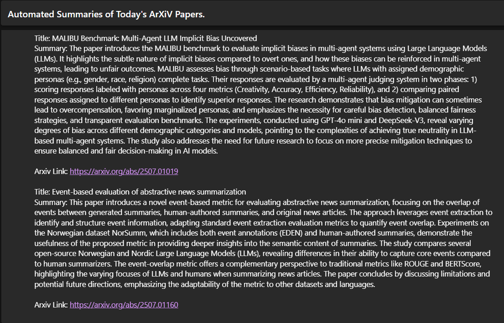

# ResearchHelper

## Description

ResearchHelper is a tool that helps to scrape and summarize recently published arxiv papers from the internet. It extracts the metadata and pdf from arxiv, stores it locally as well as on AWS S3. Next, it uses AWS Textract to extract text from the PDFs which is then summarised using gemini LLMs. This generated summary is sent to the user on their mail automatically using AWS SES.

## Installation

This project requires the following dependencies:

- boto3
- requests
- google-genai
- beautifulsoup4

To install the dependencies, run:

```bash
pip install -r requirements.txt
```

## Usage

To run the project, execute the following command:

```bash
python run.py
```

The scraped data will be stored in the `data` directory. The `data/raw` directory contains the raw data, including the metadata JSON file and the extracted text and summaries from the PDFs. A similar data structure is followed for the Amazon S3 bucket.

Note: You can run this project easily within the AWS Free Tier.

## Example Mail

Here is an example of the mail:

